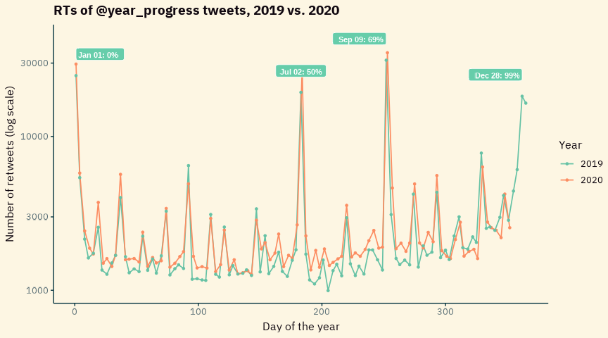
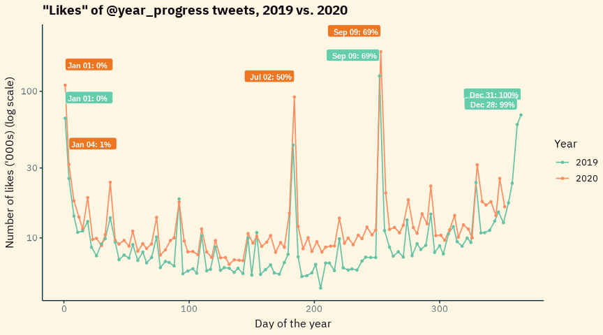
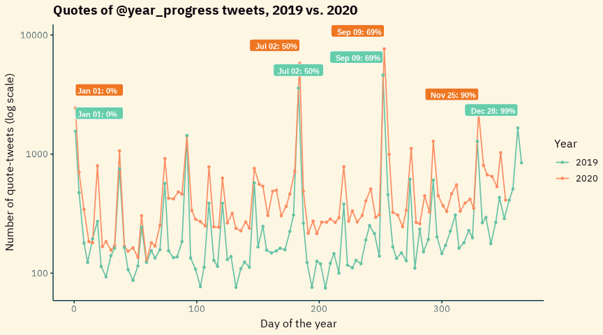

Looking at tweets by @year\_progress 2019-2020
================
December 20, 2020

<!-- README.md is generated from README.Rmd. Please edit that file -->
<!-- badges: start -->
<!-- badges: end -->

<div id="flow">

I was randomly interested in whether there might be patterns in the
amount of interaction with tweets from the **@year\_progress** bot
during 2020 :scream:, and what the shape of the year might look like
compared to 2019.

This gave me a chance to review the current landscape of `R` clients for
the twitter API :disappointed:. After doing this review, I decided it
would be easier and more satisfying for me to script my own access to
[v2 of the
API](https://developer.twitter.com/en/docs/twitter-api/early-access).

This meant more practice with `httr`, error handling, working with lists
with the frankly brilliant [`purrr`
toolkit](https://purrr.tidyverse.org/), and with writing functions.
Happy as a :pig: in :poop:, *tbqhwy*.

It’s also chance for me to try various other things I haven’t really
used before:

-   Creating a GitHub README as an `.Rmd` file (this very file here),
    instead of my usual `.md`, so I might incorporate some output charts
-   Using a couple of [Pandoc’s Markdown
    extensions](https://pandoc.org/MANUAL.html#pandocs-markdown)
    <sup>[1](# "We've got md_extensions: +emoji+bracketed_spans+inline_notes going on in the yaml here")</sup>
-   GitHub Actions (set up using the `usethis` helper function)
-   Making *a whole actual package* :package: just for a little bit of
    fun like this, as opposed to as some bigger project
-   Learning a bit more about testing with `testthat`
-   Yet more practice at package architecture and requirements, and
    appeasing R CMD check
-   Doing some hopefully nice <span class="sparkle">dataviz</span>
    :bar_chart: with `ggplot2`, which I still don’t feel like I have
    really used *well* yet. My charts usually look way too crappy for my
    liking.

If you suspect that this whole idea was essentially driven by
pre-Christmas/end-of-term task avoidance, angst and procrastination, you
would be correct.

``` r
# Set variables and run overall query -------------------------------------


# Obtained originally by:
# user_id <- get_user_id(username = "year_progress")
# It isn't going to change, so once obtained just hardcode it:
year_progress_id <- "3233484298"

# This doesn't work with the Twitter API
# https://github.com/tidyverse/lubridate/issues/941
# start_2019 <- lubridate::make_datetime(2019) %>% 
#   lubridate::format_ISO8601(usetz = TRUE)
# so instead:

start_2019 <- "2019-01-01T00:00:02Z"

# see `R/get_user_twetes.R` for how this works
dtf <- get_user_twetes(user_id = year_progress_id, start = start_2019) %>%
  purrr::compact() %>%
  unpack_list()       # <- in `R/helpers.R`
```

I realised the other day that it would be fine to call a dataframe `dtf`
instead of boring old `df` :smirk:…

<!--html_preserve-->
<blockquote class="twitter-tweet" data-width="550" data-lang="en" data-dnt="true" data-theme="light">
<p lang="und" dir="ltr">
dtf <a href="https://t.co/6fn2QaMSAB">pic.twitter.com/6fn2QaMSAB</a>
</p>
— Fran Barton (@ludictech)
<a href="https://twitter.com/ludictech/status/1338815874770329602?ref_src=twsrc%5Etfw">December
15, 2020</a>
</blockquote>
<!--/html_preserve-->

``` r
glimpse(dtf)
#> Rows: 199
#> Columns: 7
#> $ id            <chr> "1339495580318445570", "1338166812408745987", "133683...
#> $ retweet_count <int> 2551, 4223, 2199, 2456, 2555, 2777, 6331, 1608, 1847,...
#> $ reply_count   <int> 69, 122, 58, 140, 97, 102, 177, 48, 64, 52, 52, 68, 4...
#> $ like_count    <int> 16305, 25431, 14175, 17636, 16770, 17683, 31534, 1001...
#> $ quote_count   <int> 411, 1028, 533, 649, 670, 803, 2245, 351, 418, 388, 3...
#> $ text          <chr> "¦¦¦¦¦¦¦¦¦¦¦¦¦¦¦ 96%", "¦¦¦¦¦¦¦¦¦¦¦¦¦¦¦ 95%", "¦¦¦¦¦¦...
#> $ created_at    <chr> "2020-12-17T09:00:07.000Z", "2020-12-13T17:00:04.000Z...
```

Let’s lick this dataframe into shape :icecream: so it’s ready for
visualising.

``` r
dtf2 <- dtf %>% 
  # filter out any "normal" tweets!
  filter(str_detect(text, "^(\u2591|\u2593)+")) %>% 
  mutate(pcnt = as.numeric(str_extract(text, "[0-9]+"))) %>% 
  mutate(date_tweeted = case_when(
    # 100% tweets get tweeted just _after_ midnight on 1st Jan: need correcting
    # Be better here to check *if* date == January 1 but OK for now
    pcnt == 100 ~ as_date(created_at) - period(1, "days"),
    TRUE ~ as_date(created_at))) %>% 
  mutate(year = year(date_tweeted)) %>% 
  mutate(yday = yday(date_tweeted)) %>% 
  mutate(wkdy = weekdays(as_date(date_tweeted))) %>% 
  mutate(across(c(year, wkdy), ~ as.factor(.)))
```

Let’s look at how retweets vary through the year:

``` r
dtf2 %>% 
  filter(year == 2019) %>% 
  slice_max(n = 4, order_by = retweet_count) %>% 
  mutate(label = str_glue("{format(date_tweeted, '%b %d')}: {pcnt}%")) %>% 
  left_join(dtf2, .) %>% 
  ggplot(aes(yday, retweet_count)) +
  geom_line(aes(colour = year), size = 0.6, alpha = 1,) +
  geom_point(aes(colour = year), size = 1) +
  geom_label(
    aes(label = label),
    vjust = "outward",
    hjust = "inward",
    nudge_y = 0.1,
    fill = "aquamarine3",
    colour = "white",
    size = 3,
    fontface = "bold") +
  scale_colour_brewer("Year", palette = "Set2") +
  scale_y_log10() +
  labs(
    x = "Day of the year",
    y = "Number of retweets (log scale)",
    title = "RTs of @year_progress tweets, 2019 vs. 2020"
  )
```



Certain tweets are vastly more popular than the rest, with four tweets
standing out as peaks - even when a log scale is employed on the y axis.
The next tranche of popularity is reserved for the multiples of 10%,
apart from 50% which is already one of the top four retweeted.

There doesn’t seem to be a particularly different trend affecting the
popularity of tweets or the pattern of retweets as 2020 has progressed,
relative to 2019. 2020 numbers are generally a little higher, which is
most likely due to the account having acquired more followers over time.

Let’s see if the numbers of likes for each tweet show a similar pattern
(we’d generally expect them to):

``` r
dtf3 <- dtf2 %>% 
  filter(year == 2019) %>% 
  slice_max(n = 4, order_by = like_count) %>% 
  mutate(label_2019 = str_glue("{format(date_tweeted, '%b %d')}: {pcnt}%")) %>% 
  left_join(dtf2, .)

dtf3 %>% 
  filter(year == 2020) %>% 
  slice_max(n = 4, order_by = like_count) %>% 
  mutate(label_2020 = str_glue("{format(date_tweeted, '%b %d')}: {pcnt}%")) %>% 
  left_join(dtf3, .) %>% 
  mutate(like_count = like_count/1000) %>% 
  ggplot(aes(yday, like_count)) +
  geom_line(aes(colour = year), size = 0.6, alpha = 1) +
  geom_point(aes(colour = year), size = 1) +
  geom_label(
    aes(label = label_2019),
    vjust = "outward",
    hjust = "inward",
    nudge_y = 0.1,
    fill = "aquamarine3",
    colour = "white",
    size = 3,
    fontface = "bold") +
  geom_label(
    aes(label = label_2020),
    vjust = "outward",
    hjust = "inward",
    nudge_y = 0.1,
    fill = "chocolate2",
    colour = "white",
    size = 3,
    fontface = "bold") +
  scale_colour_brewer("Year", palette = "Set2") +
  scale_y_log10() +
  labs(
    x = "Day of the year",
    y = "Number of likes ('000s) (log scale)",
    title = "\"Likes\" of @year_progress tweets, 2019 vs. 2020"
  )
```



And quote tweets:

``` r
dtf3 <- dtf2 %>% 
  filter(year == 2019) %>% 
  slice_max(n = 4, order_by = quote_count) %>% 
  mutate(label_2019 = str_glue("{format(date_tweeted, '%b %d')}: {pcnt}%")) %>% 
  left_join(dtf2, .)

dtf3 %>% 
  filter(year == 2020) %>% 
  slice_max(n = 4, order_by = quote_count) %>% 
  mutate(label_2020 = str_glue("{format(date_tweeted, '%b %d')}: {pcnt}%")) %>% 
  left_join(dtf3, .) %>% 
  # mutate(quote_count = quote_count/1000) %>% 
  ggplot(aes(yday, quote_count)) +
  geom_line(aes(colour = year), size = 0.6, alpha = 1) +
  geom_point(aes(colour = year), size = 1) +
  geom_label(
    aes(label = label_2019),
    vjust = "outward",
    hjust = "inward",
    nudge_y = 0.1,
    fill = "aquamarine3",
    colour = "white",
    size = 3,
    fontface = "bold") +
  geom_label(
    aes(label = label_2020),
    vjust = "outward",
    hjust = "inward",
    nudge_y = 0.1,
    fill = "chocolate2",
    colour = "white",
    size = 3,
    fontface = "bold") +
  scale_colour_brewer("Year", palette = "Set2") +
  scale_y_log10() +
  labs(
    x = "Day of the year",
    y = "Number of quote-tweets (log scale)",
    title = "Quotes of @year_progress tweets, 2019 vs. 2020"
  )
```



Now, am I imagining it, or is there a much higher proportional
difference between 2019 and 2020 when it comes to the QTs, than was
visible with the RTs and the Likes? From about day 80? There’s some
quite big gaps in there between the two lines, particularly if you look
at the period between day 80 and day 200. 2020 never drops down below
100 QTs for any tweet like 2019 did.

The gap is a bit less noticeable in the 70-percents, around day 270-280,
when 2019’s figures start to pick up as the end of the year approaches.
Again, some of this may just be a factor of more people following the
account, and RTs and QTs generate more follows, and so it goes round.

I’ll be interested to see what happens to 2020’s final few data points
in the closing days of December.

</div>
